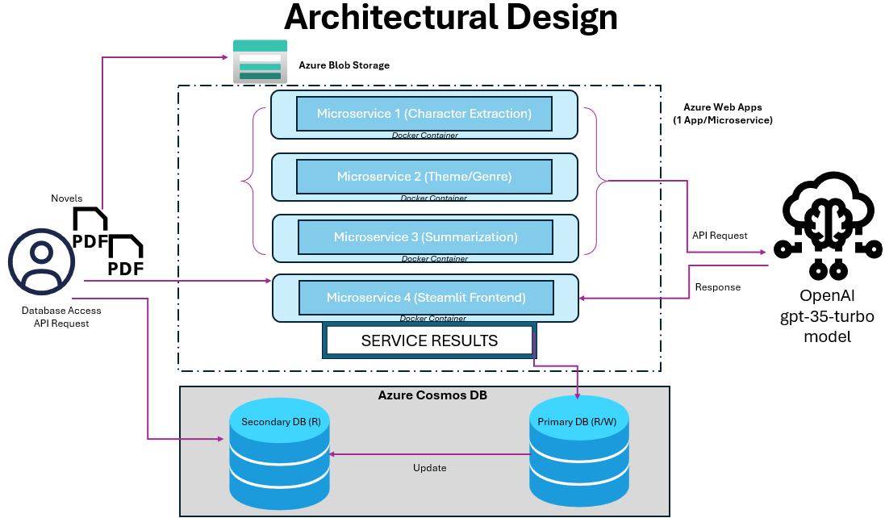
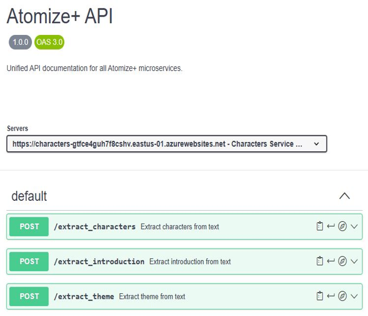
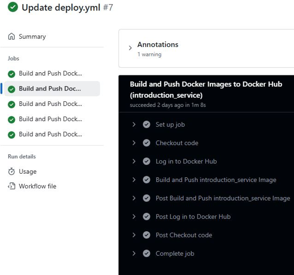
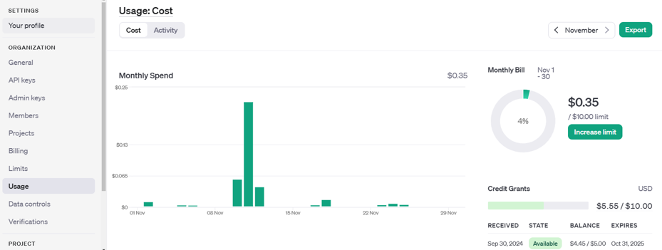
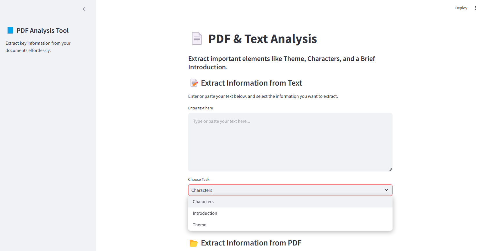

#  Atomize+

**Atomize+** is a cloud-based PDF/e-book summarization platform that extracts:
-  Character descriptions  
-  Genre and theme  
-  Concise summary  

Powered by **OpenAI GPT-3.5 Turbo** and deployed using **Dockerized microservices** on **Azure**, this modular app enables interactive analysis of long-form documents like novels or reports.

---

##  Architecture Overview



Each microservice performs a **stateless computational task**:

- `character_service`: Extracts key characters  
- `theme_service`: Detects genre/theme  
- `introduction_service`: Generates summaries  
- `streamlit_frontend`: User interface  

Services are deployed independently using Azure App Services and Azure Blob + Cosmos DB for persistent storage.


###  Swaggerhub API



---

##  Local Development Setup

>  Make sure you have **Docker Engine** installed and running.

### Step-by-Step Instructions:

1. **Clone the repository**
   ```bash
   git clone https://github.com/YOUR_USERNAME/atomize-plus.git
   cd atomize-plus
   ```

2. **Prepare your environment**

   - Place a `.env` file **inside each microservice folder** (`character_service/`, `theme_service/`, etc.) with the following content:
     ```env
     OPENAI_API_KEY=your_openai_api_key
     ```

3. **Uncomment required lines**

   - In each `app.py` file, **uncomment** the following:
     ```python
     from dotenv import load_dotenv
     load_dotenv()
     ```

   - In `docker-compose.yml`, uncomment:
     ```yaml
     env_file:
       - ./<microservice_name>/.env
     ```

   - In each `Dockerfile`, uncomment:
     ```dockerfile
     COPY .env /app/.env
     ```

4. **Build and run**
   ```bash
   cd app/
   docker-compose build
   docker-compose up -d
   ```


5. **Access the app**  
   Open your browser and go to:  
    [http://localhost:8501](http://localhost:8501)

---

##  VM / Cloud Deployment via GitHub CI/CD

1. **Push your code to GitHub**

2. **Add the following secrets** to the GitHub repository:

   | Key               | Value                |
   |------------------|----------------------|
   | `DOCKER_USERNAME`| your DockerHub ID    |
   | `DOCKER_PASSWORD`| your DockerHub token |
   | `OPENAI_API_KEY` | your OpenAI API key  |

3. **Deploy using Docker Compose**
   ```bash
   docker-compose -p atomize up --build -d
   ```

   The GitHub Actions pipeline will automatically handle image build and deployment.

###  Git Actions CI/CD   


---

##  Tech Stack

-  OpenAI GPT-3.5 Turbo  
-  Docker / Docker Compose  
-  Azure App Services, Azure Blob Storage, Azure Cosmos DB  
-  Python + Streamlit + Flask  
-  GitHub Actions (CI/CD)  
-  NoSQL Data Models (JSON-based)

---

##  Features

 Modular Microservices  
 NoSQL Schema Design  
 OpenAPI Integration (SwaggerHub)  
 CI/CD Automation via GitHub  
 Cloud-Native Deployment Ready  

---

##  Known Limitations

-  Latency due to OpenAI API response time  
-  Cost may increase with large documents  
-  Data privacy concerns for proprietary documents  


###  OpenAI API request usage


---

##  Future Scope

- Enable multi-language summarization  
- Optimize calls using batching/token control  
- Add user authentication and logging features  

---

##  APP Screenshots

###  Web Interface  


---

## 📄 License

This project is licensed under the **MIT License**.  
You are free to use, modify, and distribute it **as long as proper credit is given to Abideep Kondal**.
